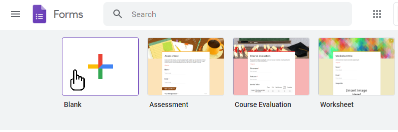
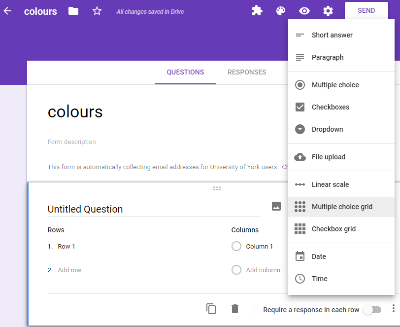
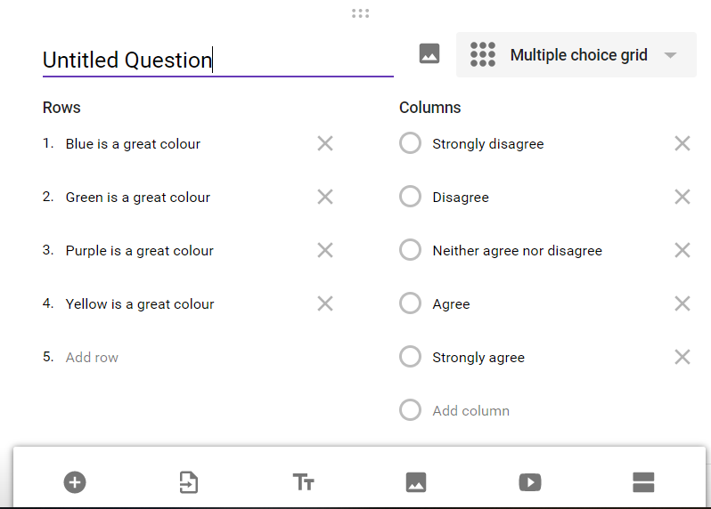
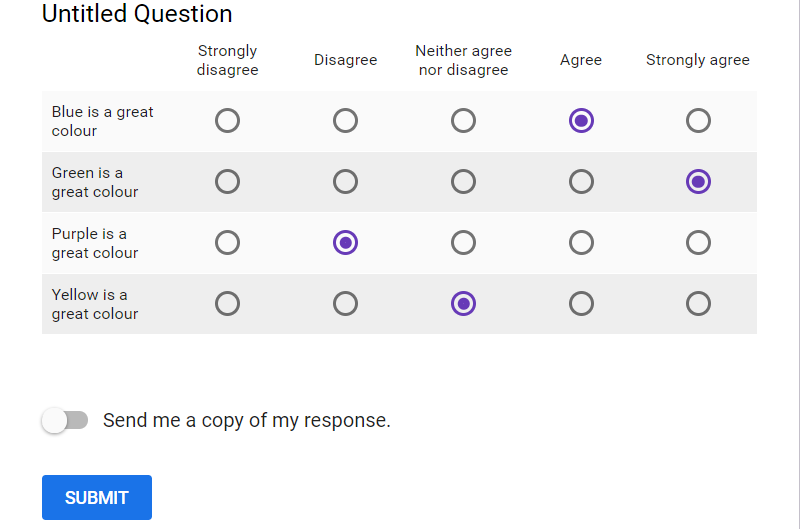
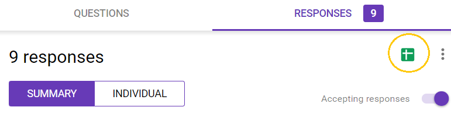

```{r setup, include=FALSE}
knitr::opts_chunk$set(echo = TRUE, 
                      message = FALSE,	
                      warning = FALSE)
options(htmltools.dir.version = FALSE)
```


```{r pkgs, include=FALSE}
library(RefManageR)
library(kableExtra)
library(dplyr)
```

```{r, load-refs, include=FALSE, cache=FALSE}
BibOptions(check.entries = FALSE,
           bib.style = "numeric",
           cite.style = "authoryear",
           style = "markdown",
           hyperlink = FALSE,
           dashed = FALSE)
myBib <- ReadBib("bibliography.bib", check = FALSE)
```


# Introduction

This workflow will teach you how to set up [Google Forms](https://docs.google.com/forms/u/0/?tgif=d) survey with Likert `r Cite(myBib, "likert1932technique")` scale questions, read the responses in to R and report on the results.

--

A Likert scale question asks people to respond to a series of statements in terms of the extent to which they agree with them.

```{r eg-data, include=FALSE}
df <- data.frame("Strongly disagree" = c("o","o","o","o"),
                 "Disagree" = c("o","o","o","o"),
                 "Neither agree nor disagree" = c("o","o","o","o"),
                 "Agree" = c("o","o","o","o"),
                 "Strongly agree" = c("o","o","o","o"),
                 row.names = c("Blue is a great colour",
                               "Green is a great colour",
                               "Purple is a great colour",
                               "Yellow is a great colour"),
                 check.names = F)
```

```{r eg-tab, echo=FALSE}
df %>% 
  knitr::kable(caption = "To what extent do you agree with the following:",
               escape = FALSE,
               align = "c") %>%
  kable_styling(bootstrap_options = c("striped", "condensed"),
                font_size = 12) %>%
  column_spec(1:5, width = "3cm")
```


A list of similar answers is usefully listed on [Simply Psychology](https://www.simplypsychology.org/likert-scale.html) `r Cite(myBib, "Mcleod_undated-tt")`


---
# Introduction | Why?

By scripting the process of reading your data directly from the record of responses and plotting it, you can examine your results at any point during the survey. 

If you decide to extend the deadline or receive additional responses you can create new summaries and plots in minutes just by rerunning the script.

You'll have just one copy of your data avoiding potential update anomalies.

---
# Workflow | Ingredients

You will need:

* a google account
* R and RStudio

This workflow assumes you have a little familiarity with using these.

The steps required are

* Set up Googleform
* Get R ready
* Create response googlesheet
* Read in data
* Format data
* Summarise data
* Plot data

---
# Workflow | Set up Googleform

## Create form

Go to [Forms](https://docs.google.com/forms/u/0/?tgif=d) and start a new blank form.



---
# Workflow | Set up Googleform

## Add question

.pull-left[
Give your form a name - I used the name 'colours'.

Choose the style of question called 'Multiple choice grid'
]
.pull-right[

]

---
# Workflow | Set up Googleform

## Add question options

.pull-left[
Add your answer options as Columns. For example:
* Strongly disagree
* Disagree
* Neither agree nor disagree
* Agree
* Strongly agree

Add your statements as Rows. For example:
* Blue is a great colour
* Green is a great colour
* Purple is a great colour
* Yellow is a great colour

]
.pull-right[

]
---
# Workflow | Set up Googleform

The survey is ready.

.pull-left[
## Preview it 

]

--
.pull-right[

## Respond
Submit several responses. You will need responses to plot later.


]
---
# Workflow | Get R ready

## Packages needed

You will need these packages:

* `googlesheets` `r Cite(myBib, "bryan_and_zhoa")`
* `dplyr` `r Cite(myBib, "wickham_et_al")`
* `likert` `r Cite(myBib, "Bryer_and_Speerschneider")`

Install these as follows:

```{r eval=FALSE}
install.packages("googlesheets")
install.packages("dplyr")
install.packages("likert")
```

Additional packages may also be installed if you do not have them on your system.

Then load them into R for use:

```{r}
library(googlesheets)
library(dplyr)
library(likert)
```

You don't need to worry about the warnings

---
# Workflow | Create response gsheet

## Create

You read the data from a googlesheet generated from from the form.

Go back to the survey editor, click on Responses and click on the Googlesheet icon to create a googlesheet of the responses.


**Note the title of your googlesheet. In my case this is: "colours (Responses)"**

---
# Workflow | Read in data

## Register the sheet for use

You need to register the sheet for use with `gs_title()`. 
Your googlesheet may have a different name!
```{r}
colours <- gs_title("colours (Responses)")
```

This will open a browser to ask you to allow the googlesheets package access your googlesheets. Choose Allow.

## Read in data

```{r}
coloursurvey <- gs_read(colours)
```

---
# Workflow | Read in data

## Understand data format

`gs_read()` creates a tibble (a data structure similar to a dataframe). It has a column for each of the questions and one for time of the response and the email of the responder (unless you make the form anonymous).


```{r tibble-tab, echo=FALSE}
coloursurvey[1:3,] %>% 
  knitr::kable() %>% 
  kable_styling(font_size = 11) %>%
  column_spec(1:6, width = "2.5cm")
```

We won't need the first two columns.

---
# Workflow | Format data

To use the `likert` package on our data, we need to 1. convert the tibble to a dataframe and 2. format our columns

## 1. Convert to dataframe

`coloursurvey[-(1:2)` drops the first two columns.

The `check.names = FALSE` argument means the spaces in the questions (column names) are retained.

```{r}
coloursurveydf <- data.frame(coloursurvey[-(1:2)], 
                           check.names = FALSE)

```

```{r df-tab, echo=FALSE}
coloursurveydf[1:3,] %>% 
  knitr::kable() %>% 
  kable_styling(font_size = 11) %>%
  column_spec(1:4, width = "2.5cm")
```

---
# Workflow | Format data

## 2. Format the columns
We need to a) change the column names b) make them factor variables with the levels in a useful order (from Strongly disagree to Strongly agree).

### a) Change column names

We **sub**stitute the part of the name in `pattern` with  `replacement`. In this case the replacement is an empty string, `""`. The `\\` is because `[` and `]` are characters with special meanings in patterns and we need to indicate they should be treated just as the character without its special meaning.
```{r}
names(coloursurveydf) <- names(coloursurveydf) %>% 
  sub(pattern = "Untitled Question \\[*", replacement = "") %>% 
  sub(pattern = "\\]", replacement = "")
```

---
# Workflow | Format data

## 2. Format the columns

### a) Turn in to factors with the levels in useful order

Create a variable to hold the levels in order to make later code easier to write and read.
```{r}
my_levels <- c("Strongly disagree",
               "Disagree",
               "Neither agree nor disagree",
               "Agree",
               "Strongly agree")
```
---
# Workflow | Format data

## 2. Format the columns

### a) Turn in to factors with the levels in useful order

You must put back ticks around column names with spaces.

```{r}
coloursurveydf <- coloursurveydf %>% 
  mutate(`Blue is a great colour` = factor(`Blue is a great colour`,
                                           levels = my_levels),
         `Green is a great colour` = factor(`Green is a great colour`,
                                            levels = my_levels),
         `Purple is a great colour` = factor(`Purple is a great colour`,
                                             levels = my_levels),
         `Yellow is a great colour` = factor(`Yellow is a great colour`,
                                             levels = my_levels))
```

---
# Workflow | Summarise data

The `likert()` function generates a summary of the data which gives the percentage of answers in the disagree, agree or neutral categories. In addition it gives the mean response with standard deviation using numeric values 1 to 5 for Strongly disagree to Strongly agree.

```{r}
colsummary <- likert(coloursurveydf)
summary(colsummary)
```


---
# Workflow | Plot data

A default plot can be obtained with:

```{r fig.height=4, fig.width=9}
plot(colsummary)
```

---
# Workflow | Plot data

Some options to modify the plot include: moving the legend and losing its title and changing the text size and colours.

```{r fig.height=4, fig.width=9}
p <- plot(colsummary,
     legend.position = "top",
     legend = "",
     text.size = 4,
     low.color = "lightblue",
     high.col = "lightgreen")
p
```
---
# Workflow | Plot data

In addition, since the likert package uses `ggplot`, you can add other ggplot items. 
For example, change all the text size with `theme()`

```{r fig.height=4, fig.width=11}
p + theme(text = element_text(size = 15)) 

```

---
# Where to go from here
The package has other options for centring the data differently, ordering the questions and so on. 

You can see some of the options using 
```{r eval=FALSE}
demo('likert', package='likert')
```

Also take a look at Jason Bryer's [Project on github](https://github.com/jbryer/likert)
---

# References

```{r refs, echo=FALSE, results="asis"}
PrintBibliography(myBib)
```

<a rel="license" href="http://creativecommons.org/licenses/by-nc-sa/4.0/"></a><br /><span xmlns:dct="http://purl.org/dc/terms/" property="dct:title">Workflows: Likert Scale Survey. From google form to graph.</span> by <span xmlns:cc="http://creativecommons.org/ns#" property="cc:attributionName">Emma Rand</span> is licensed under a <a rel="license" href="http://creativecommons.org/licenses/by-nc-sa/4.0/">Creative Commons Attribution-NonCommercial-ShareAlike 4.0 International License</a>.